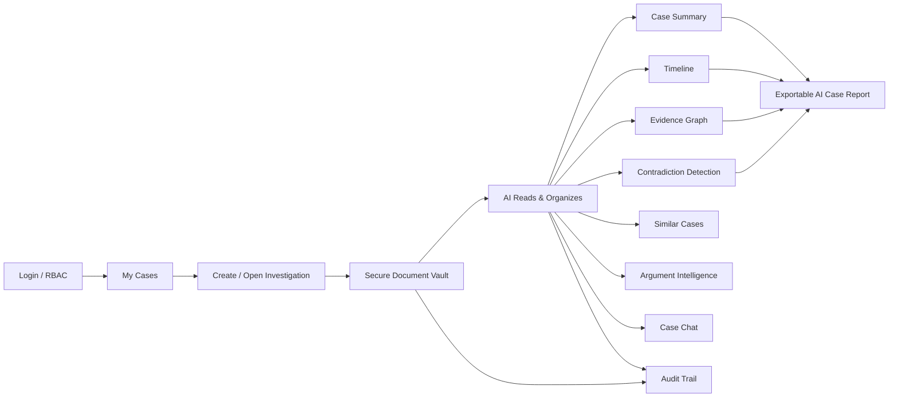
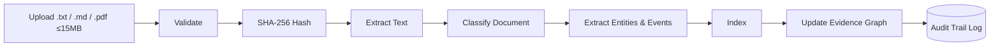
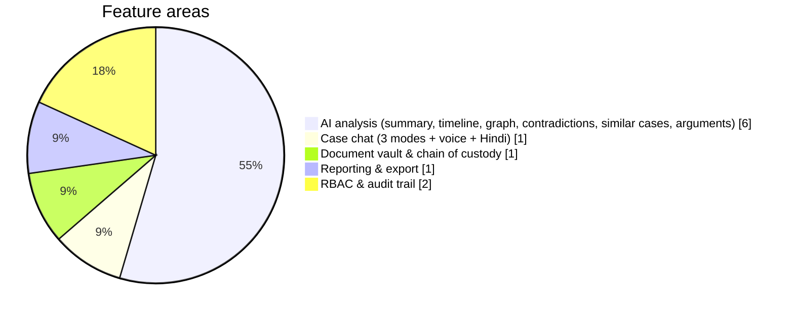
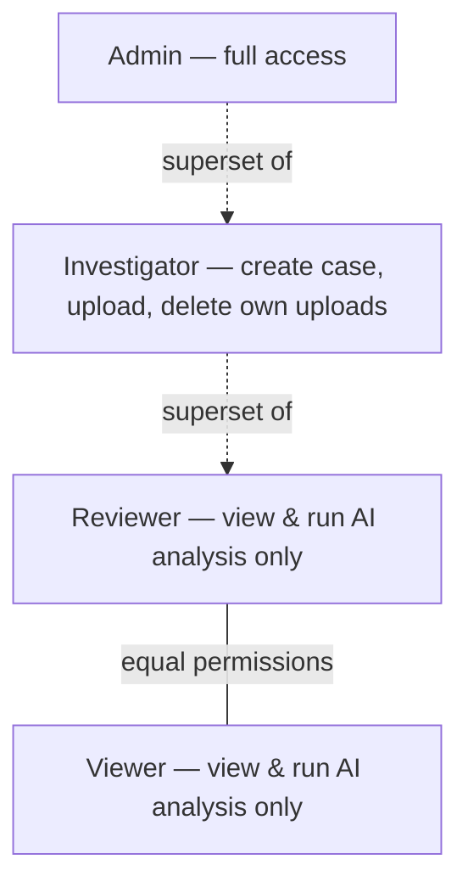
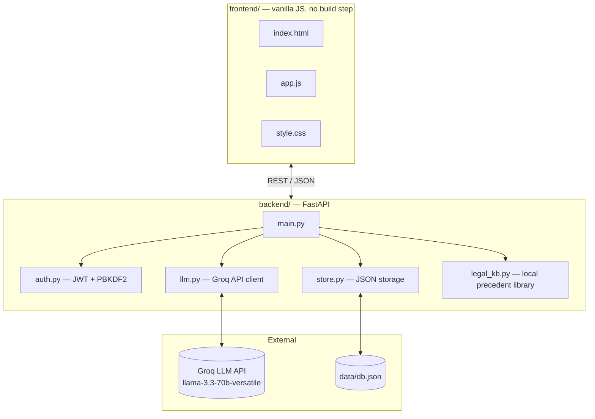
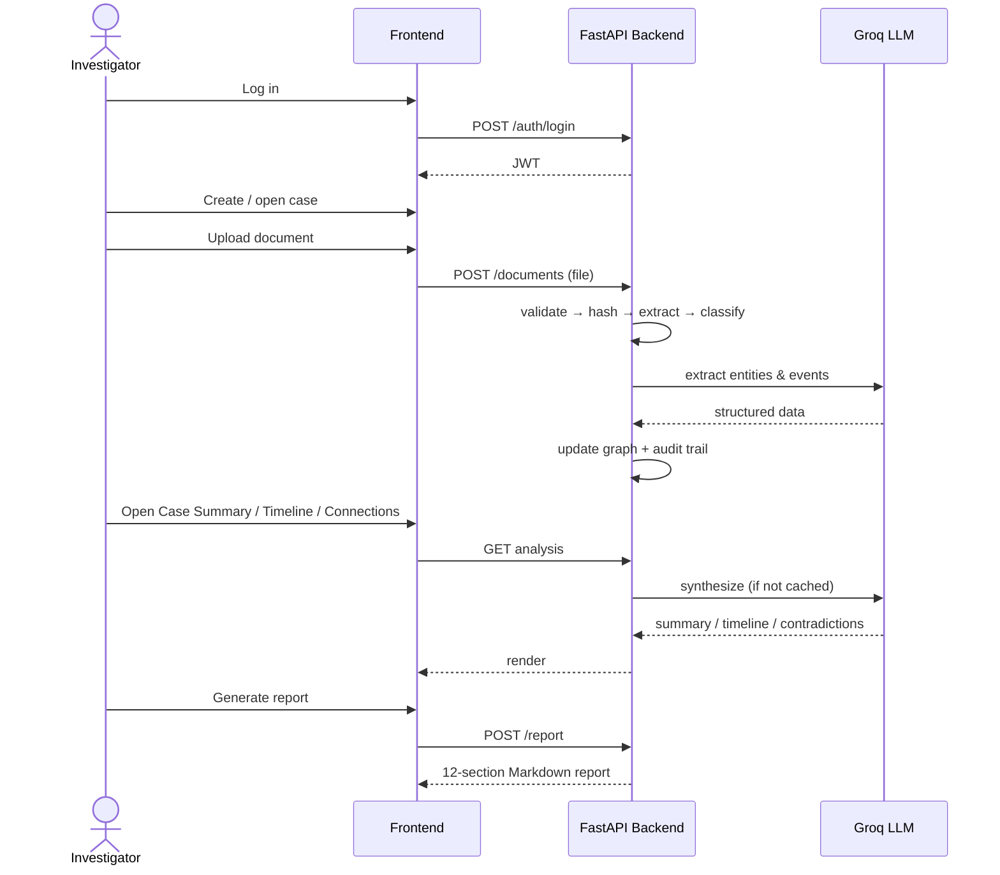

# AI Case Report

**A secure, AI-powered multi-case investigation platform** — built for Smart India Hackathon (SIH).

🔗 **Live app:** https://law1.onrender.com/
📦 **Repo:** https://github.com/utkarsh4964-stack/law1

Investigators upload raw case documents (statements, FIRs, notes, reports) and the platform automatically builds a structured, evidence-linked case file: summary, timeline, entity/relationship graph, contradiction detection, similar-case matching, argument intelligence, and a grounded case-chat assistant — all backed by an audit trail.

---

## 1. Overview



Every document upload runs through a visible processing pipeline, and every sensitive action — logins, uploads, deletions, report generation — is written to the audit trail.



---

## 2. Features

| # | Tab | What it does |
|---|-----|---------------|
| 00 | **Dashboard** | Document / person / event / contradiction counts, recent case activity |
| 01 | **Document Vault** | Upload & manage evidence; SHA-256 hash + full chain of custody per document; search/filter by type |
| 02 | **Case Summary** | AI-synthesized narrative across every document in the case |
| 03 | **Timeline** | Chronological, evidence-linked event list; flags gaps of 30+ days; click an event to jump to its source document |
| 04 | **Connections** | Interactive people/org/location graph (vis-network); click an edge to see the evidence behind it |
| 05 | **Contradictions** | Conflicting claims across documents, each with a conflict type and confidence score — always framed as "requires human verification" |
| 06 | **Similar Cases** | Matches the case against a local precedent library, framed as pattern similarity, never an outcome prediction |
| 07 | **Argument Intelligence** | Evidence-grounded potential arguments and fair counterarguments (analysis aid, not a courtroom simulator) |
| 08 | **Case Chat** | Grounded Q&A in Case / Evidence / Legal Knowledge modes, with a Hindi toggle and hold-to-speak voice input (Chrome/Edge) |
| 09 | **Report** | 12-section structured Markdown report, generated on demand and downloadable |
| 10 | **Audit Trail** | Who did what, and when — every sensitive action on the case |

### Feature mix



---

## 3. Role-based access control

Four demo accounts are seeded on first run:

| Username | Password | Role |
|---|---|---|
| `admin` | `admin123` | Admin |
| `investigator` | `investigator123` | Investigator |
| `reviewer` | `reviewer123` | Reviewer |
| `viewer` | `viewer123` | Viewer |

| Action | Admin | Investigator | Reviewer | Viewer |
|---|:---:|:---:|:---:|:---:|
| View case / run AI analysis | ✅ | ✅ | ✅ | ✅ |
| Create case | ✅ | ✅ | ❌ | ❌ |
| Upload documents | ✅ | ✅ | ❌ | ❌ |
| Delete documents | ✅ | own uploads only | ❌ | ❌ |
| Delete case | ✅ | ❌ | ❌ | ❌ |



---

## 4. Architecture / stack



| Layer | Technology |
|---|---|
| Backend | Python, FastAPI, served via `uvicorn` |
| Frontend | Plain HTML / CSS / JS, served as static files by FastAPI (no build step) |
| AI | Groq API — `llama-3.3-70b-versatile` |
| Auth | JWT + PBKDF2 password hashing |
| Storage | Single JSON file (`data/db.json`) |
| Graph visualization | vis-network |
| PDF parsing | `pypdf` (text extraction only) |
| Voice input | Browser Web Speech API (Chrome/Edge) |

---

## 5. Getting started

```bash
# 1. Get a free Groq API key
# → https://console.groq.com/keys (no credit card needed)

# 2. Set up the backend
cd backend
python -m venv venv
source venv/bin/activate        # Windows: venv\Scripts\Activate.ps1
pip install -r requirements.txt
cp .env.example .env
# edit .env → GROQ_API_KEY=gsk_...

# 3. Run it
uvicorn main:app --reload
# open http://localhost:8000
```

### Deployment (Render / Railway / Fly.io)

- Build command: `pip install -r requirements.txt`
- Start command: `uvicorn main:app --host 0.0.0.0 --port $PORT`
- Root directory: `backend`
- Env vars: `GROQ_API_KEY`, and a real `JWT_SECRET` in production (don't use the default)

---

## 6. What's genuinely built vs. demo-scaled

Everything listed above is functional, not mocked — but a few pieces are intentionally demo-scale:

| Area | Current state | Before real production use |
|---|---|---|
| Similar Cases / Legal Knowledge | Small hand-written local library (`legal_kb.py`) | Swap in a licensed, indexed case-law/statute corpus |
| Document integrity | Hash computed on upload; "verify" re-hashes extracted text, no persisted original binary | Add a binary blob store for true evidentiary integrity checks |
| Auth | PBKDF2 + JWT, no refresh tokens, lockouts, or password reset | Add those flows |
| Storage | Single JSON file, process-level lock only | Move to a real database with concurrency control |
| Chat / report context | Full document text goes directly into model context, no vector retrieval | Add embeddings + a vector store for large casefiles |
| Voice input | Browser Web Speech API only | Add server-side speech processing for broader browser support |
| PDF support | Text extraction only | Add OCR for scanned/image PDFs |

---

## 7. Typical session



---

*Built for Smart India Hackathon (SIH) — a demonstration platform for authorized investigators and legal professionals.*
